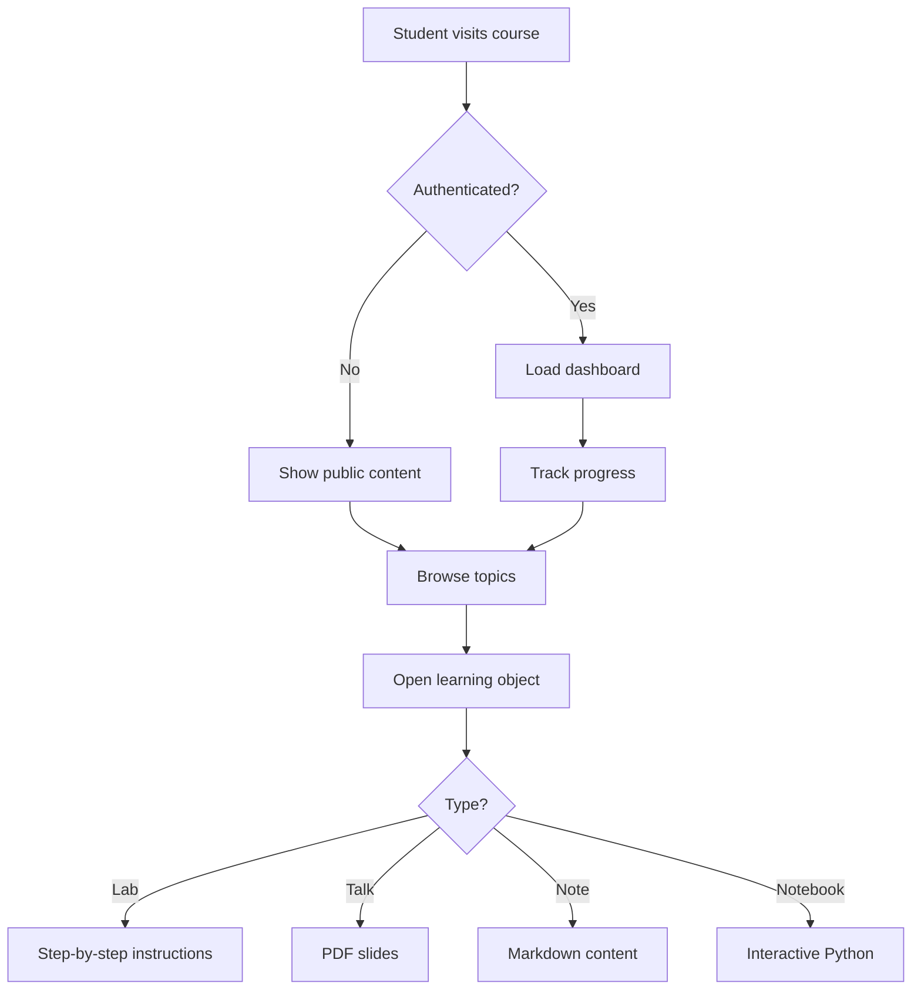
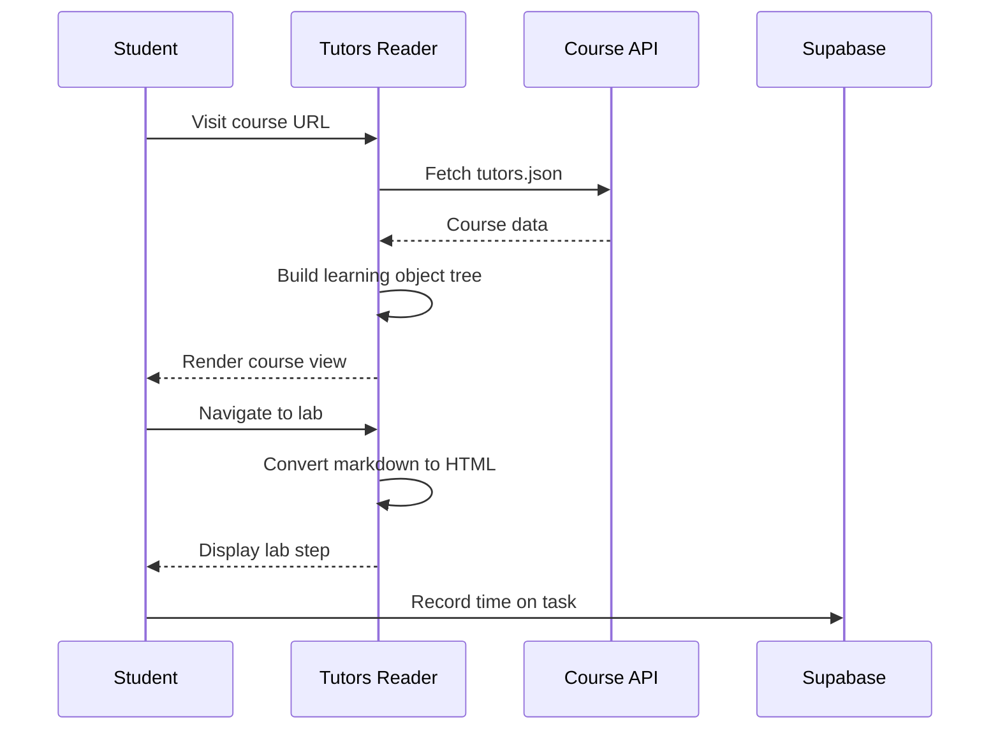
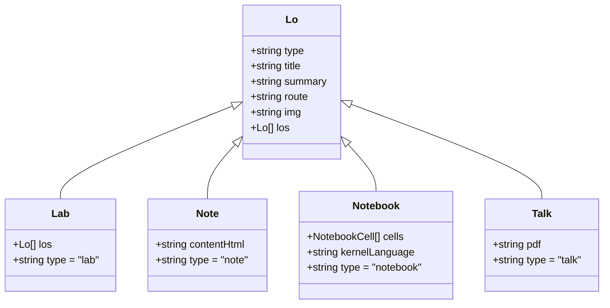
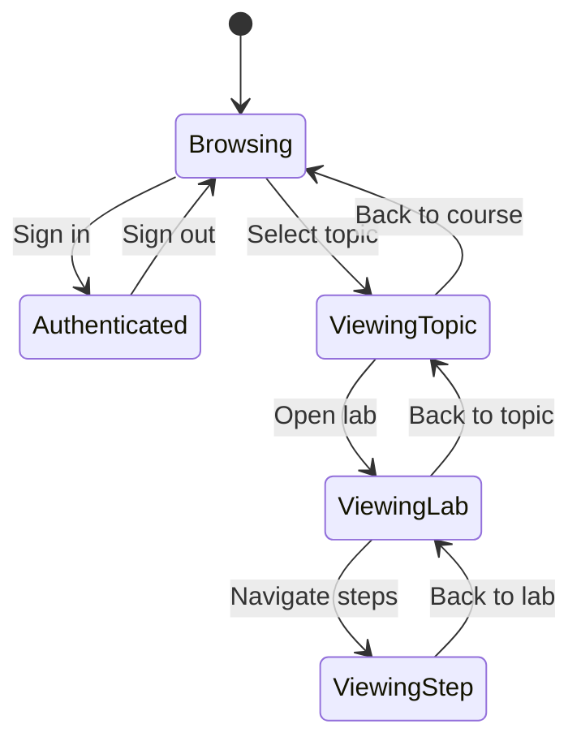
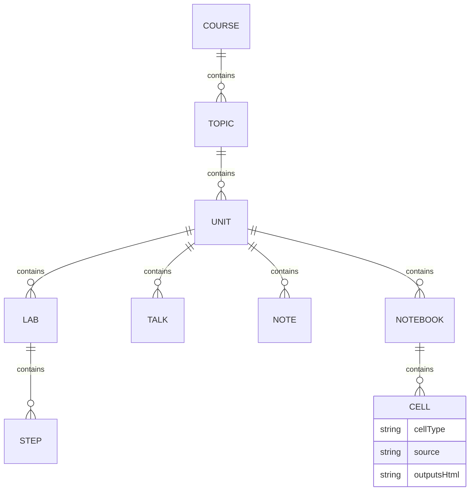
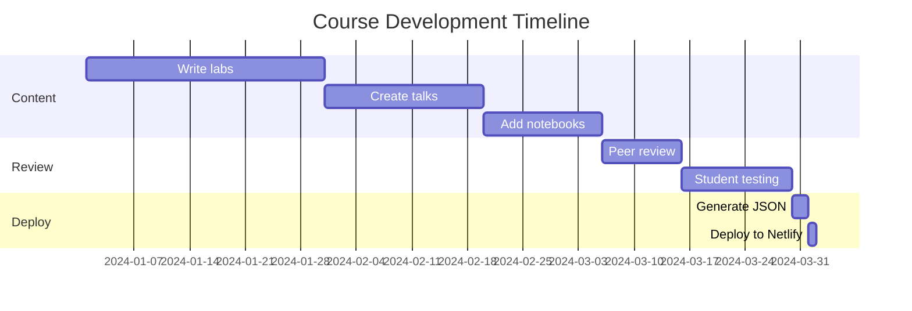
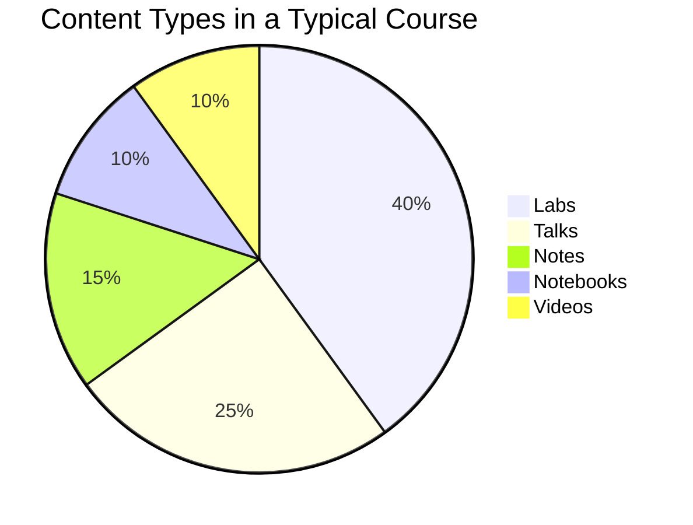
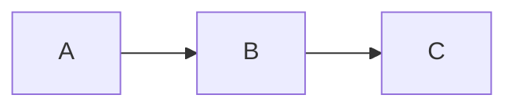

---
icon:
  type: material-icon-theme:mermaid
---
# Mermaid Diagrams

Tutors supports [Mermaid.js](https://mermaid.js.org/) diagrams directly in markdown content. Use standard fenced code blocks with the `mermaid` language identifier.

## Flowchart

## Sequence Diagram

## Class Diagram

## State Diagram

## Entity Relationship Diagram

## Gantt Chart

## Pie Chart

## Usage

To include a Mermaid diagram in any note, lab step, or panel note, simply use a fenced code block:

~~~

~~~

Mermaid diagrams are rendered client-side and support all standard Mermaid diagram types including flowcharts, sequence diagrams, class diagrams, state diagrams, ER diagrams, Gantt charts, pie charts, and more.
